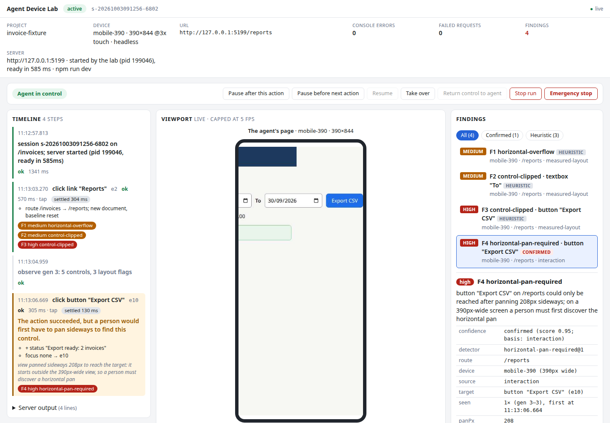

# Agent Device Lab

Agent Device Lab lets a coding agent start your web app, use it on a phone-sized screen, and report what breaks, while you watch.

- **It runs your project.** The lab starts the services your app needs, in order, or attaches to ones already running. When it finishes it stops only what it started.
- **It gives the agent a small, exact view.** The agent gets a short list of the controls on screen, each with a ref (`e1`, `e2`, ...). After every click or keystroke it gets only what changed.
- **It finds layout defects.** It records problems a person would hit on a small screen, such as a button pushed off the edge, each with measurements and the steps to reproduce it.
- **You stay in charge.** A local dashboard shows the agent's screen live. You can pause the agent, take over the browser, hand it back, or stop the run.

The same commands work from a terminal (`agentlab`), from an MCP server for Claude Code and Codex, and in CI with predictable exit codes.



**Status:** Web V1 (`0.3.0`). It is tested on Linux x64 (Debian 12 and Ubuntu 24.04) with Node.js 22 and 24. macOS, Windows and arm64 are untested, and Alpine does not work. See [Limitations](#limitations).

## Install

You need **Node.js 22 or newer**.

```bash
npm install -g agent-device-lab     # the command it installs is `agentlab`
agentlab install-browser                 # the Chromium build the lab needs (add --with-deps on a bare Debian or Ubuntu image)
agentlab doctor                          # checks Node, the browser and your environment
```

To build it from source instead:

```bash
git clone https://github.com/Colony-Innovations/agent-device-lab.git && cd agent-device-lab
npm ci && npm pack                       # builds and writes agent-device-lab-<version>.tgz
npm install -g ./agent-device-lab-*.tgz
```

Per-project installs, `npx`, upgrading and uninstalling are in [docs/install.md](docs/install.md).

## Try it

The fastest way to learn the lab is the [getting-started guide](docs/getting-started.md). It takes about ten minutes, uses a small demo app with a defect planted in it, and shows the real output of every command.

In your own project the short version is:

```bash
cd /path/to/your-app

agentlab init          # shows what it detected and the agentlab.json it proposes; writes nothing until you confirm
agentlab start         # starts your app, opens a phone-sized browser, prints the first observation
agentlab ui            # opens the dashboard so you can watch

agentlab observe       # the controls on screen, with refs
agentlab click e3      # by ref; or: agentlab click --name "Save" --role button
agentlab fill e6 "Acme Ltd"
agentlab inspect       # the findings recorded so far, with evidence and reproduction steps

agentlab sweep /reports   # one page at 320, 390, 768 and 1440 px
agentlab stop          # closes the browser and stops only the services the lab started
```

The browser has no window of its own. You watch it in the dashboard, so nothing covers your screen. Pass `--headed` to `start` if you also want a browser window.

The lab reads one file in your project, `agentlab.json`. A minimal one:

```json
{
  "schemaVersion": 2,
  "name": "my-app",
  "services": { "web": { "command": "npm run dev", "url": "http://127.0.0.1:5173", "readiness": { "path": "/" } } },
  "app": { "service": "web" },
  "device": "mobile-390"
}
```

The lab runs only the commands written there, so committing the file is how you approve them. Every setting is in [docs/configuration.md](docs/configuration.md).

## Use it from your coding agent

`agentlab mcp` is an MCP server with 25 tools that mirror the terminal commands. Register it once:

```bash
claude mcp add --scope user agentlab -- "$(command -v agentlab)" mcp --headless     # Claude Code
codex mcp add agentlab -- "$(command -v agentlab)" mcp --headless                   # Codex CLI
```

Then ask your agent, for example: "Start the lab on this project, open the Reports page and tell me what breaks at phone width." The agent calls `start` with your project's path, then observes and acts. Setup details, the tool list and what the agent should do on each error are in [docs/mcp.md](docs/mcp.md).

## Watch and step in

Every session serves a dashboard on `127.0.0.1`. Run `agentlab ui` in the project directory to open it.

- The centre shows the agent's screen live. During a sweep or scan it follows the width being measured, and a line above it says what you are looking at.
- The left shows each action and what it changed. The right shows the findings.
- The buttons let you **pause** the agent, **take over** the browser, **return** control, **stop** the run, or use the **emergency stop**.

The link the agent receives is view-only. Only the link from `agentlab ui` has the controls. While you have control the agent's actions are refused with a clear message, and it must look at the page again before it continues. See [docs/dashboard.md](docs/dashboard.md).

## Run it in CI

```bash
agentlab test --validate-only      # check the profile and environment; start nothing
agentlab test --out agentlab-results
```

`agentlab test` starts the project, runs the flows, sweeps and scans your profile selects, stops what it started, and exits **0** for pass, **1** when the policy failed, **2** when it could not run and **3** on a timeout. It writes a JSON result, a JUnit file, an HTML report, evidence and failure bundles, and keeps secrets out of all of them. A failure bundle can be re-run later with `agentlab replay`. See [docs/ci.md](docs/ci.md) and the [GitHub Actions example](examples/ci/github-actions.yml).

## How findings work

Each finding has an id, a device, a severity, a confidence, measurements in CSS pixels and the steps to reproduce it from the start of the session. A finding stays recorded even when a later action succeeds.

A finding is **confirmed** only when a measurement shows a person is affected: a hit test, an interaction, clipping, a WCAG rule or the browser's layout-shift metric. Everything else is **heuristic**, and a heuristic is never high severity without such a measurement. The detectors and the scan rules are described in [docs/web-v1-m2.md](docs/web-v1-m2.md).

## Limitations

- Linux x64 with glibc only. macOS, Windows and arm64 are untested, and Alpine does not work.
- The devices are Chromium emulation, not real phones: no iOS Safari, no on-screen keyboard.
- Supervision is cooperative, not a sandbox. It stops an agent that uses the lab's commands; it does not contain an agent that has a shell.
- The findings are only as good as the detectors, and a sweep sees a page only as it first loads. Use scans for drawers, dialogs and other states.

The full list and the roadmap are in [docs/limitations.md](docs/limitations.md).

## Documentation

Start with the [documentation index](docs/README.md). The pages people need most:

| to | read |
| --- | --- |
| learn the tool step by step | [docs/getting-started.md](docs/getting-started.md) |
| install, upgrade or uninstall | [docs/install.md](docs/install.md) |
| write `agentlab.json` | [docs/configuration.md](docs/configuration.md) |
| look up a command or flag | [docs/cli.md](docs/cli.md) |
| connect an agent over MCP | [docs/mcp.md](docs/mcp.md) |
| watch and supervise a session | [docs/dashboard.md](docs/dashboard.md) |
| gate a pipeline | [docs/ci.md](docs/ci.md) |
| fix a problem | [docs/troubleshooting.md](docs/troubleshooting.md) |
| understand what is and is not protected | [docs/security.md](docs/security.md) |

Measurements of the lab, including a benchmark against Playwright MCP and runs on four independent apps, are listed under [Evidence](docs/README.md#evidence) in the index. Each states its method and its caveats.

## Contributing and security

Building, testing and the project's rules are in [CONTRIBUTING.md](CONTRIBUTING.md). Report a security issue privately as described in [SECURITY.md](SECURITY.md), not in a public issue. Changes by release are in [CHANGELOG.md](CHANGELOG.md).

## Support development

If Agent Device Lab is useful to you, you can support its ongoing development
for $2/month on [Patreon](https://www.patreon.com/Ikafa).
Support is completely optional.

## Licence

Apache License 2.0. See [LICENSE](LICENSE) and [NOTICE](NOTICE). Copyright 2026 Colony Innovations.
