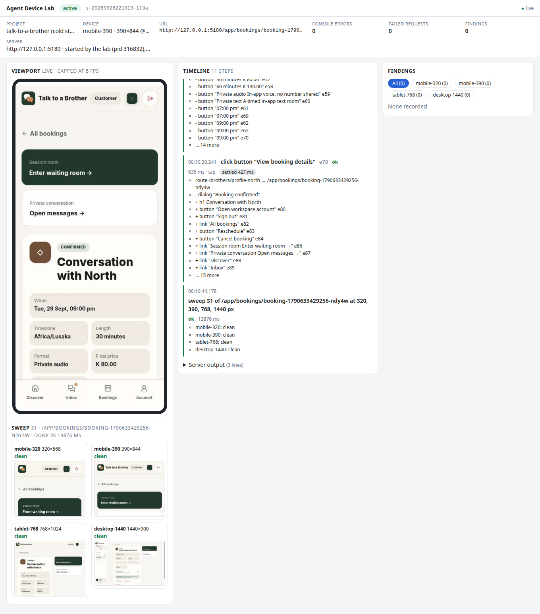

# Independent app: Talk to a Brother (29 September 2026)

This is the first time Agent Device Lab has been run against an application that was not written as its fixture. It covers:

- the app and its setup;
- lifecycle checks;
- one customer journey through MCP while the dashboard was watched;
- what went wrong and how the runtime was fixed;
- the new responsive sweep on five routes;
- a matched comparison with Playwright MCP.

## The app

| | |
| --- | --- |
| Source | `~/talk-to-a-brother`, a separate repository on this machine, commit `314a41e`, clean tree. It is the owner's in-progress product, not a lab fixture. |
| Stack | React 19, TypeScript, Vite 8, React Router 7, Zustand 5 and Tailwind 4, run with `bun`. |
| Data | An in-browser mock API over seeded data persisted in `localStorage` (`VITE_API_MODE=mock`). There is no backend, database or other service to start. The mock waits 350 ms on `setTimeout` per request. |
| Changes to the app | **None.** The lab profiles were kept outside the app (they are not published with this repository). The only setup is Vite's own CLI flags (`--host 127.0.0.1 --port 5180 --strictPort`), so a lab-owned instance never collides with the developer's server on 5173. |
| Declared services | One, the Vite dev server. Readiness is `GET /` returning 200. |

There are two profiles:

- **The cold-start profile (`agentlab.json`).** It runs `bun run dev --host 127.0.0.1 --port 5180 --strictPort` from `../../../talk-to-a-brother`, with `reuseExisting: false`, so a stray server is reported as a conflict rather than silently reused.
- **The attach profile (`attach.agentlab.json`).** It points at `http://127.0.0.1:5173`, the developer's running server, with `reuseExisting: true`.

```bash
agentlab start --project <profiles>                      # cold start, owned
agentlab start --project <profiles>/attach.agentlab.json # attach to :5173, not owned
```

## Lifecycle

| Check | Observed |
| --- | --- |
| **Cold start** | Vite was ready in 0.86–1.47 s; the whole `start`, including Chromium, took about 5–7 s. The lab owned process group `sh → bun → vite`. On `stop`, all three processes exited and port 5180 was released. |
| **Attach** | While the developer's `vite` (pid 219179, started 20:42:29) was serving 5173, the lab reused it (`owned: false`). It clicked through the app, then stopped. The same pid, with the same start time, still answered 200. |
| **Owned-only cleanup** | Covered by new tests in `test/runtime.test.mjs`. A wrapper → server tree (the `bun` → `vite` shape) is stopped entirely on close. A server the test started itself is left running. |
| **Benchmark runs** | 12 of 12 runs ended with nothing on port 5180. The lab's runs stopped the server they started; the harness stopped its own for Playwright MCP. |

One cleanup gap was observed, and it wasn't the lab's. A throwaway script of mine piped its output to `head -1`, which killed the script (EPIPE) before it reached `lab.close()`. The orphaned `bun`/`vite` group had to be stopped by hand.

An in-process `Lab`, as used by `agentlab run` or a custom script, had no crash-recovery record at the time of this run; only the CLI daemon had one. Since Web V1 milestone 3 every session writes an ownership record, and `agentlab clean` stops what an in-process session left behind.

## Journey through MCP, watched in the dashboard

The journey: sign in as the demo customer, open North's profile, book a paid 30-minute private audio session at the first free time, then open the booking details. After that the script swept the booking page, ran `inspect`, and stopped.

It ran as a script: an MCP SDK client against `agentlab mcp` with a headed browser. The client picks controls the way an agent does, from the latest observation by role, name and (new in this slice) `context`. A second browser rendered the dashboard throughout.

Final run:

| step | result |
| --- | --- |
| `start` | cold start 4.9 s. First observation: 14 controls, 5 headings. |
| log in, fill ×2, sign in | `route /login → /app/discover` after settling for 1.04 s, which covers the mock's 350 ms timer and the route animation. The password shows as `••••`. |
| `View profile` in "North" | chosen by `context`; `route → /brothers/profile-north` |
| `Continue to available times` | `+ dialog "Book your conversation"` |
| a time slot | `~ button e61 not pressed; ~ button e62 pressed` |
| `Pay & confirm` | `dialog "Book your conversation" → "Booking confirmed"` |
| `View booking details` | `route → /app/bookings/booking-…`, `+ h1 Conversation with North` |
| `sweep`, `inspect`, `stop` | clean at 320, 390, 768 and 1440 (13.9 s, headed); no findings; owned server stopped |

The journey took 10.9 s from cold, with 0 action errors. The dashboard showed 11 timeline entries, the sweep with four thumbnails, a live frame, and no page errors.



### What went wrong first, and the general fixes

The first attempts used the CLI. These are the problems this app exposed, in the order found. Each fix is general, and each is covered by `test/runtime.test.mjs` or `test/sweep.test.mjs`. For fixes 3, 6 (in the sweep) and 8, and for the scroll-region rule, I also confirmed that the test fails when the fix is removed from the built code. The other fixes were not mutation-checked.

| # | Symptom on this app | Class | Cause | Fix |
| --- | --- | --- | --- | --- |
| 1 | The first observation of `/` listed 6 controls (header and footer only); the hero and cards were missing. | Missed UI | A 320 ms `route-enter` fade starts from `opacity: 0`, so the content was "invisible" at observation time. | Settling waits for finite running animations; infinite ones are ignored. |
| 2 | A loading screen with `aria-busy="true"` sat for about 370 ms with no DOM mutation. | Missed UI | DOM-quiet did not consider busy state. | Settling waits while a visible `aria-busy` region exists (timeout cause `busy`). |
| 3 | `click "Sign in"` reported `~ button "Sign in"→"Signing in…"` and settled after 213 ms; the redirect was never reported. | **Missed UI change** | The mock API waits on `setTimeout`, with no network request and no DOM change. | An init script tracks short one-shot timers, `settle.timerMaxMs` (default 1000, 0 disables); intervals and deep chains are ignored. Now: `route /login → /app/discover`. |
| 4 | Three identical `link "View profile"` entries, and time slots named `"09:00 pm"` ×3. | **Confusing observation** | The link text is the same on every card (an accessibility weakness in the app). | Controls sharing a role and name get `context`: their card's heading ("North"), or the group label ("Tue 30 Sep"). |
| 5 | Choosing "30 minutes" or a time slot reported only `focus`. | **Missed UI change** | `aria-pressed` was not observed. | `pressed` is observed and diffed: `~ button e62 pressed`. |
| 6 | The sweep flagged `button "Filters"` and `link "View details"` as **high, confirmed obstructions** at 390 px. | **Detector false positive** | Each control was partly visible, so it wasn't scrolled, and its centre sat under the app's fixed bottom tab bar. The same logic would have made a real `click` fail with `obstructed`. | When the centre is covered by a fixed or sticky element, scroll the control to the centre and hit-test again, in both `click` and the sweep. Both findings disappeared, and the tests keep a genuinely covered control confirmed. |
| 7 | A sweep of `/` took 33 s. | Performance | The app sets `scroll-behavior: smooth`, so the sweep's `scrollTo(0, 0)` animated for each control (and made measurements race). | Reset with `behavior: 'instant'`. Now about 8 s per route, mostly Vite loading modules cold in each new context. |
| 8 | `actions.jsonl` and every finding's reproduction steps contained `fill textbox "Password" with "demopassword"`. | Secret handling | History recorded raw fill values; only observations masked passwords. | Fields with `type=password` or a password, one-time-code or card autocomplete hint are recorded as `‹secret› (N characters)` everywhere. The journey artifacts were regenerated. |

App behaviours seen, which are not lab issues and were not changed:

- a signed-in customer sees "Log in / Get started" on a Brother's public profile;
- the booking details page keeps the previous page's title;
- link text repeats ("View profile") with no distinguishing accessible name.

## Responsive sweep on the app

Five routes were swept while signed in as the demo customer. Each width used an isolated context carrying the session's storage.

| route | 320 | 390 | 768 | 1440 | time |
| --- | --- | --- | --- | --- | --- |
| `/` | clean | clean | clean | clean | 8.4 s |
| `/app/discover` | clean | clean | clean | clean | 8.7 s |
| `/brothers/profile-north` | clean | clean | clean | clean | 8.1 s |
| `/app/bookings` | clean | clean | clean | clean | 8.3 s |
| `/app/bookings/booking-…` (created in the session) | clean | clean | clean | clean | 13.9 s (headed) |

Before fix 6, `/app/discover` and `/app/bookings` each carried one false high obstruction at 390 px.

Independent ground truth for `/brothers`, from plain Playwright plus screenshots: at every width the document width equals the viewport width and no element crosses the edge, which agrees with "clean". There is one real cosmetic defect the sweep **cannot** see. It is inside the Filters drawer, which the sweep never opens: at 320 px "Show 3 results" wraps to two lines (75.6 px, beside a 50.8 px "Reset"). The lab also has no text-wrap check.

The sweep's claim is therefore narrower than "the page is responsive". It says that, as loaded, nothing overflows and every control can be reached without a sideways pan or an obstruction.

## Comparison with Playwright MCP

**Conditions.**

- **Agent and tasks.** Identical for both tools: `claude -p` with `claude-sonnet-5`, the same system prompt as the fixture benchmark, the same task text, no built-in tools, `--max-turns 60`.
- **Browser.** The same Chromium 153 binary, headless, starting from the `mobile-390` settings.
- **Run order.** One run at a time on a 2-core Celeron 5205U, with 3 interleaved runs per cell.
- **Cold start.** Every run began with nothing on port 5180. Playwright MCP cannot start an app, so the harness started `bun run dev` before those runs and timed spawn to first 200. In the lab's runs the agent's `start` did it, and cold start is the lab's recorded `readyMs`. Interaction time is wall time minus the cold start that happened inside the run.
- **Resizing.** Playwright MCP could not call `browser_resize` in the journey, but could in the responsive task. The lab used `sweep`, whose tablet and desktop profiles also change touch, mobile mode and user agent; `browser_resize` changes only the size.
- **Journey completion.** Counted from what the tools returned: a `/app/bookings/booking-…` page headed "Conversation with North".
- **Responsive completion.** All four widths actually exercised, through resize calls or the sweep's devices.
- **Labels.** Every reported defect was checked by hand and, where possible, by measurement.

The raw data (per-run records, transcripts and answers) is kept by the maintainers and is not published with this repository.

### Every run

| run | tool | done | cold start | interaction | calls | out tokens | result bytes | screenshots | tool errors | defects reported → manual label |
| --- | --- | --- | --- | --- | --- | --- | --- | --- | --- | --- |
| 01 journey r1 | lab | yes | 1.21 s | 82.9 s | 15 | 2143 | 40.2 KB | 0 | 0 | 1 → true (stale title) |
| 02 journey r1 | Playwright | yes | 0.73 s | 75.2 s | 23 | 3853 | 201.7 KB | 2 | 1 | 2 → 1 true (logged-out header), 1 FP (tab bar over "Reminder" row; clears on scroll) |
| 05 journey r2 | Playwright | yes | 0.69 s | 131.1 s | 30 | 6271 | 506.5 KB | 3 | 1 | 2 → 2 true (header, title) |
| 06 journey r2 | lab | yes | 0.92 s | 68.8 s | 14 | 2088 | 40.1 KB | 0 | 0 | 1 → true (header) |
| 09 journey r3 | lab | yes | 0.89 s | 79.1 s | 15 | 1982 | 39.1 KB | 0 | 0 | 1 → true (title) |
| 10 journey r3 | Playwright | yes | 0.79 s | 144.8 s | 33 | 6647 | 1358.2 KB | 10 | 1 | 2 → 1 true (header), 1 FP (per-country price is by design) |
| 03 responsive r1 | lab | yes | 0.91 s | 37.4 s | 5 | 644 | 11.1 KB | 0 | 0 | 0 (missed the drawer wrap) |
| 04 responsive r1 | Playwright | yes | 0.71 s | 141.8 s | 35 | 6698 | 1301.7 KB | 9 | 1 | 2 → 1 cosmetic (placeholder at 320), 1 debatable (Browse Brothers hidden on mobile) |
| 07 responsive r2 | Playwright | yes | 0.78 s | 130.9 s | 43 | 9362 | 1066.3 KB | 10 | 1 | 1 → debatable (same link) |
| 08 responsive r2 | lab | yes | 1.47 s | 36.1 s | 4 | 541 | 9.1 KB | 0 | 0 | 0 |
| 11 responsive r3 | lab | yes | 0.91 s | 89.9 s | 11 | 3720 | 25.7 KB | 0 | 0 | 0 |
| 12 responsive r3 | Playwright | yes | 0.70 s | 78.0 s | 21 | 3789 | 12.3 KB | 4 | 0 | 0 |

Every Playwright MCP tool error was the same recoverable miss, a click by description ("Log in link", "Filters button") that matched nothing before a snapshot. The lab had no tool errors.

### Medians, and what the data supports

| median (min–max) | journey: lab | journey: Playwright MCP | responsive: lab | responsive: Playwright MCP |
| --- | --- | --- | --- | --- |
| completed | 3/3 | 3/3 | 3/3 | 3/3 |
| cold start (app server) | 0.9 s (0.9–1.2) | 0.7 s (0.7–0.8) | 0.9 s (0.9–1.5) | 0.7 s (0.7–0.8) |
| agent interaction time | 79.1 s (68.8–82.9) | 131.1 s (75.2–144.8) | 37.4 s (36.1–89.9) | 130.9 s (78.0–141.8) |
| tool calls | 15 (14–15) | 30 (23–33) | 5 (4–11) | 35 (21–43) |
| output tokens | 2088 (1982–2143) | 6271 (3853–6647) | 644 (541–3720) | 6698 (3789–9362) |
| tool result bytes | 40.1 KB (39.1–40.2) | 506.5 KB (201.7–1358.2) | 11.1 KB (9.1–25.7) | 1066.3 KB (12.3–1301.7) |
| screenshots | 0 | 3 (2–10) | 0 | 9 (4–10) |
| true defects found (distinct per run) | 1 per run | 1–2 per run | 0 | 0 real layout defects |
| false positives | 0 | 1 in 2 of 3 runs | 0 | 0 (2 debatable, 1 cosmetic) |

The rule is that a difference counts only when the ranges don't overlap, with n = 3. Under that rule:

- **Supported:**
  - The lab used fewer tool calls, fewer output tokens and no screenshots, in every run of both tasks.
  - It returned fewer tool-result bytes in every journey run. On the responsive task this was true in 2 of 3 runs; run 12 of Playwright MCP measured with `browser_evaluate` and returned 12 KB.
  - The lab's cold start was slower in every run, by about 0.2 s (0.9 s against 0.7 s). The lab's readiness probe polls every 250 ms, while the harness polled every 100 ms, so part of the gap is probe granularity rather than startup work.
- **Not supported:**
  - **Time.** Interaction and wall-time ranges overlap for both tasks. The lab's fastest and Playwright MCP's fastest journeys differ by 6 s, and one lab responsive run (89.9 s) exceeded Playwright MCP's fastest (78.0 s). **No speed claim is made.**
  - **Findings quality.** No difference is supported. Each lab journey run reported exactly one true defect and nothing false. Playwright MCP journey runs found one or two true defects, and 2 of 3 also reported a false positive. Neither tool found the one real responsive defect (the drawer wrap) in the recorded runs. A Playwright MCP smoke run before recording did find it, by opening Filters and measuring the buttons, which the lab's sweep cannot do.
- **Where the lab's true findings came from:** the agent reading observations (the page title field, header controls), not the lab's detectors, which reported nothing because the app has no overflow or reach defects.

These numbers are not extrapolated from the fixture benchmark, and the fixture numbers do not transfer. This is one app, two tasks, three runs per cell, one model and one machine. The lab's MCP instructions now mention `sweep`, so its configuration differs from the fixture benchmark's.

## Follow-up: the Filters drawer with stateful scans (milestone 2)

The sweep above missed the app's one real responsive defect, because it never opened the Filters drawer. Milestone 2 ([web-v1-m2.md](web-v1-m2.md)) declares that state as a scenario in the app's profile:

```json
{ "name": "Filters drawer", "route": "/brothers",
  "steps": [{ "do": "click", "role": "button", "nameContains": "Filters", "expect": { "dialog": "Refine your search" } }] }
```

`agentlab scan --project <profiles>` (headless, cold start on 5180) reports:

| scenario | 320 | 390 | 768 | 1440 |
| --- | --- | --- | --- | --- |
| Marketplace as loaded | clean | clean | clean | clean |
| Filters drawer | 1 confirmed low, 1 heuristic | clean | clean | clean |

- **`text-wrap-change`, confirmed, low (cosmetic).** At 320 px, button "Show 3 results" wraps to 2 lines and is 75.6 px tall. At 390 px it is on 1 line and 50.8 px tall. At 320 px it is 1.49× the height of "Reset" beside it (50.8 px). Nothing is clipped, covered or hidden, so the verdict is "Cosmetic: nothing is hidden or covered". These are the same numbers the manual Playwright check found above. The finding carries both widths' frames and the reproduction: the session's open, then `scan R1: open …/brothers in a new mobile-320 context`, then `click button "Filters"`.
- **`text-wrap-change`, heuristic, low (no harm).** "Has available times" wraps at 320 px, but its height is fixed (56 px at both widths). It is reported as a warning only, because wrapping by itself is not a defect.

The first version of the wrap check called the Show 3 results wrap "functional harm: it overlaps button 'Mostly listens'". That toggle is scrolled content underneath the drawer's footer, clipped by the drawer's scroll area. Overlap is now computed on visible boxes (cut by every ancestor that does not let overflow show). The same run also showed footer links with enlarging negative margins as "sticking out" of a footer that only has a top border; a container now needs a background, a shadow or borders on three sides.

**Exploration.** With `--explore` and no configuration, the Filters button is skipped: "purpose ambiguous: no aria-haspopup, aria-expanded, aria-controls or tab role says what it opens". The app's button has no state attributes, and exploration does not guess. With `"explore": {"allow": [{"role": "button", "name": "Filters*"}]}` in the profile, exploration opens the drawer itself (and restores the page with Escape), and it reports the same wrap at 320 px only.

The app was not changed.

## Limitations found here

- **Sweep coverage.** The sweep measures routes as loaded. It doesn't open menus, drawers or dialogs, and it doesn't check text wrapping or truncation, tap-target size or visual asymmetry. The app's one real responsive defect is of exactly that kind.
- **Timer tracking** is heuristic. Promise-based sleep loops with short delays can hold settling to `maxMs`; this is reported as cause `timers`, and the fix is `settle.timerMaxMs`. The wrapper is visible to page scripts.
- **Context for repeated labels** relies on headings or a short preceding label. Cards without either still produce indistinguishable duplicates.
- **Sweep cost** is dominated by the dev server: each isolated context loads Vite's modules cold, about 2 s per width here.
- **One app, one service.** The app needed no backend. Multi-service startup (an API or a database) was untested and unsupported beyond a single declared command when this was written; Web V1 milestone 1 added named services.
- **The demo password** is in the task prompt and so in the agent transcripts. It is the app's published demo credential. None of the lab's own artifacts contain it.
